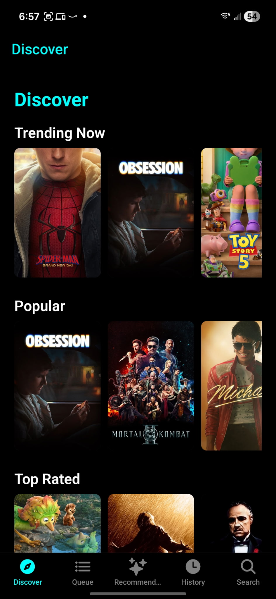
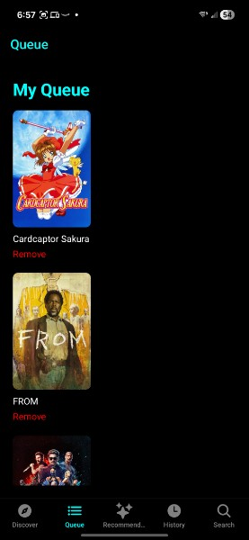
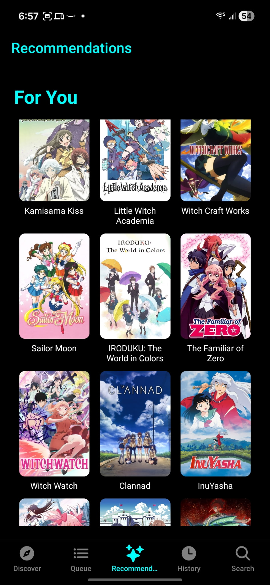

# StreamFusion

A personalized streaming-discovery app for people who are serious about what they watch. StreamFusion aggregates movies and shows into one place, lets you build a personal watch queue, tracks what you've seen, and learns your taste.

Built from scratch with React Native and Expo, deployed as a production Android app.

---

## Features

- **Discover** — Browse trending, popular, and top-rated movies and shows, plus genre-based rows, pulled live from a real content database.
- **Search** — Look up any title and get full details instantly: poster, synopsis, rating, and release date.
- **Personal Queue** — Add anything that catches your eye to a watchlist so you never lose track of it.
- **Watch History** — Mark titles as watched; the app remembers what you've seen.
- **Recommendations** — A custom recommendation engine analyzes your genre preferences and viewing patterns to surface content tailored to you.
- **Accounts** — Email/password authentication with persistent sessions.

---

## Tech Stack

| Layer | Technology |
|-------|-----------|
| Framework | React Native (Expo SDK 54) |
| Navigation | React Navigation (tab + native stack) |
| Authentication | Firebase Authentication |
| Session persistence | AsyncStorage |
| Content data | TMDB REST API (via Axios) |
| Animations | React Native Reanimated + Worklets |
| Build & distribution | Expo Application Services (EAS) |

---

## Architecture Notes

- **Navigation** combines a bottom-tab navigator (Discover, Queue, Recommendations, History, Search) with native stack navigators for detail views.
- **The recommendation engine** builds a unique feed per user from their genre frequency and viewing patterns.
- **Tab screens refresh on focus** using `useFocusEffect`.
- **Authentication state** is managed app-wide through a Firebase auth listener.

---

## Engineering Challenges Solved

Bringing StreamFusion to a working standalone Android build meant debugging a multi-layered startup failure:

- **Native dependency mismatch** — Reanimated 4 on SDK 54 needed `react-native-worklets`, not `react-native-worklets-core`.
- **App entry point** — Adding a proper `index.js` with `registerRootComponent` fixed a crash and silent splash-screen death.
- **Bundler module resolution** — Disabling `unstable_enablePackageExports` kept Metro from loading the wrong Firebase Auth build.
- **Framework breaking change** — React Navigation v7 needed a full theme object; spreading the built-in theme fixed a header crash.

---

## Status

StreamFusion is deployed and running on Android via EAS. The next phase is **SubHub** — a subscription-management platform that tracks what a user pays for, surfaces renewal dates, and flags unused subscriptions. Where StreamFusion is about discovery, SubHub is about intelligence.

---

*Built by Jaamal Oakmon — [LinkedIn](https://www.linkedin.com/in/jaamal-oakmon-34586940a)*

## Screenshots

  
  
  

